

  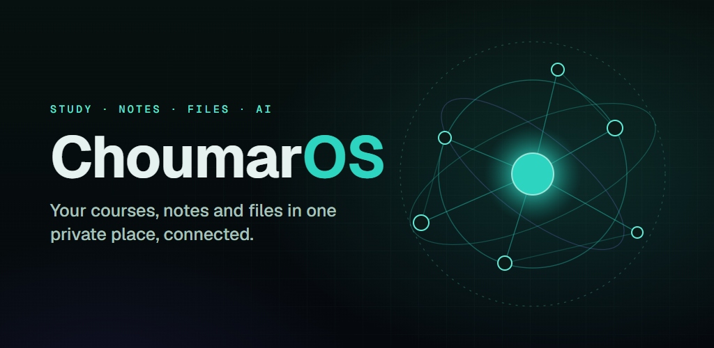

# ChoumarOS

**Your whole degree, in one place.** A free, private workspace for university students: courses,
lecture notes, files, projects and job applications — connected, searchable, and with an AI
assistant that answers from your own material and shows its sources.

**Try it:** [choumaros.de](https://choumaros.de) ·
[Microsoft Store](https://apps.microsoft.com/detail/9N7BWDMCXT58) ·
Google Play (closed testing, public release October 2026)

> This repository is a public showcase. The application's source code is private.
> Designed, built, tested and operated by [Mohamad Ali Choumar](https://choumar.is-a.dev),
> Software Engineering student at the University of Duisburg-Essen.

  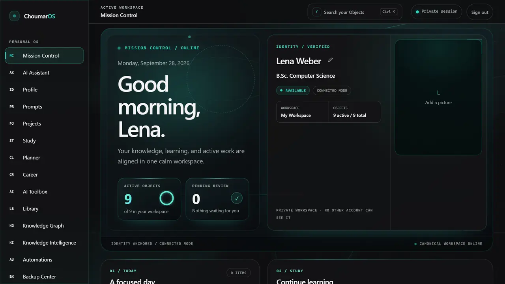
  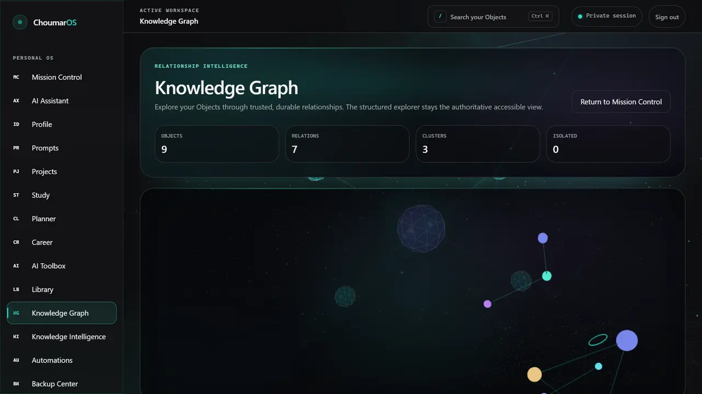

## What it does

| | |
|---|---|
| **Mission Control** | What needs you today, what you worked on last, how far each course has come. |
| **Study Hub** | Semesters, courses, credits and grades — read in from a photo of your curriculum, with text recognition running on your own device. |
| **Capture** | Drop in slides, PDFs, photos or Office files; their text becomes searchable and ChoumarOS suggests where each belongs. |
| **AI Assistant** | Explanations, revision and exam practice grounded in your own notes — every answer cites its sources. |
| **Flashcards** | Spaced repetition: each card comes back when you are about to forget it. |
| **Exams and calendar** | A countdown to your next exams, and your semester exported to any calendar app. |
| **Share with classmates** | Share one course by a read-only link; a classmate can copy it into their own workspace. One click ends the link. |
| **Knowledge Graph** | See how your courses, notes and projects connect. |
| **Three languages** | English, German and Arabic, with full right-to-left layout. |

  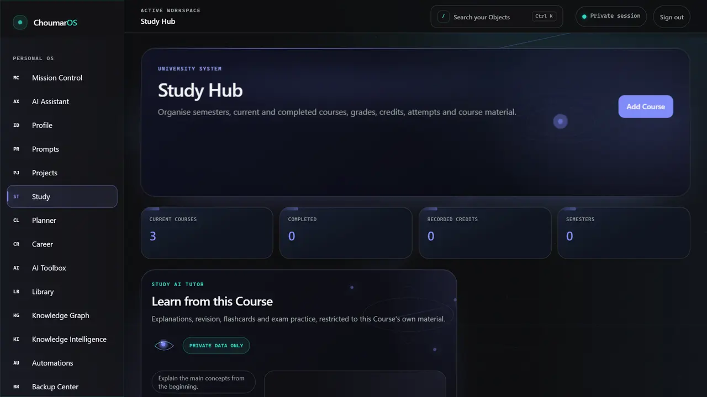
  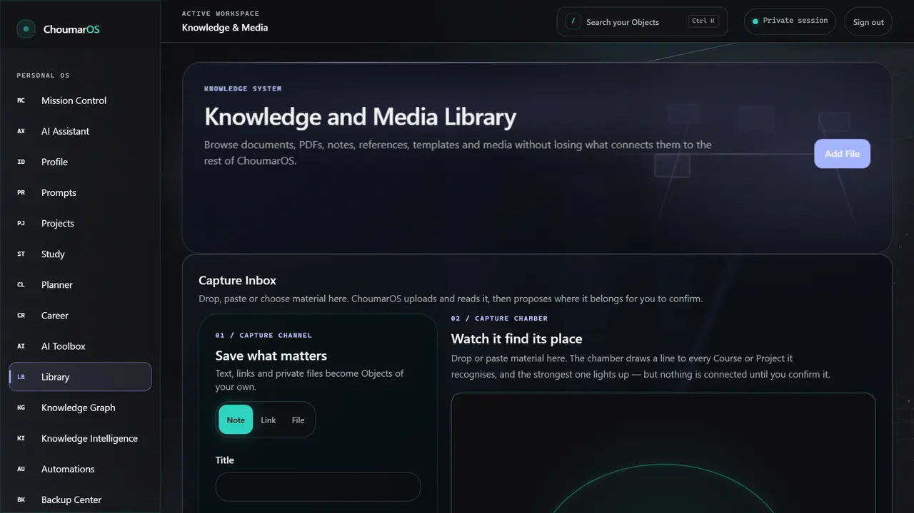

## Engineering

ChoumarOS is a one-person project held to a team's standard. The numbers below are from the
private repository as of October 2026.

**Architecture**
- Next.js 16 (App Router, Server Components first), strict TypeScript with no `any`.
- Layered: `app/features → application → domain ← infrastructure`; the domain imports no
  framework, database or browser code.
- PostgreSQL is the single source of truth; every untrusted input is parsed with Zod.
- 212 commits, about 85,000 lines in 577 files, 25 architecture decision records, 19 migrations.

**Testing — nothing ships red**
- 802 automated tests: unit tests plus integration tests against a real PostgreSQL database.
  None skipped.
- 346 browser test runs with Playwright, accessibility audits with axe-core, and runs in Firefox
  and WebKit for layout, focus and right-to-left behaviour.
- Every release passes format, lint (0 warnings), type-check, tests and a production build.

**Security and privacy**
- Row-level security on every table; one central capability policy decides who may do what,
  and missing authority always denies.
- Content-Security-Policy, no secrets in the repository, `npm audit` at 0.
- An internal audit once found a data leak between two accounts; it was closed the same day
  and is now covered by tests.
- Sharing stores only a SHA-256 of each link, never the link itself; links can be stopped at once.
- Hosted in Frankfurt; encrypted daily backups; GDPR account deletion and full export;
  cookieless analytics.

**AI, used responsibly**
- The assistant (Google Gemini) answers only from the user's own data and cites every source;
  semantic search runs on pgvector.
- Retrieved content is treated as untrusted (prompt-injection defence), and the AI can never
  change data.

**How it was built**
AI coding agents (Claude Code) are a tool in this project, not its author. I write the
requirements and architecture decisions, steer the implementation, review every diff and answer
for the result. The test suite is the proof — not the model's promise.

  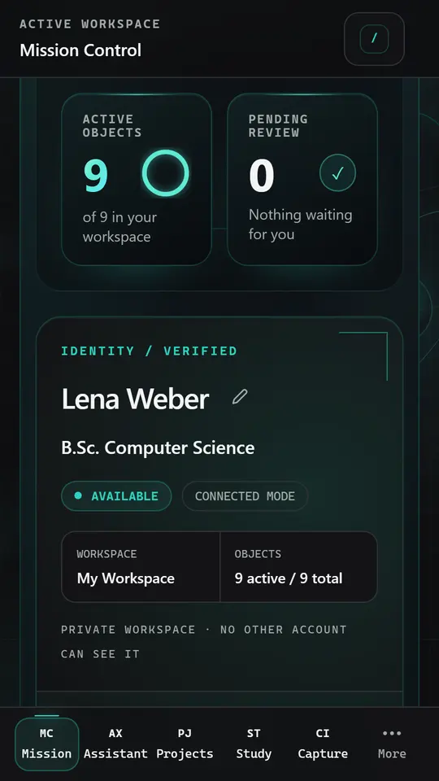
  &nbsp;
  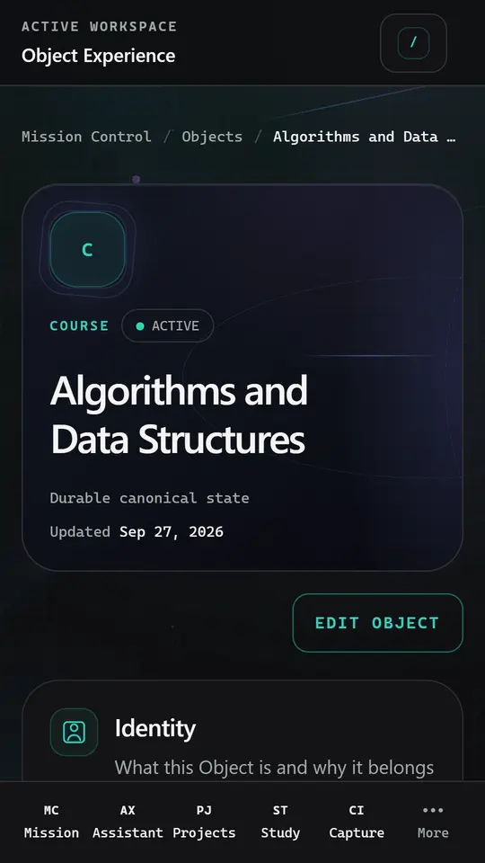

## In three languages

Every screen exists in English, German and Arabic. Arabic is a real right-to-left layout, not a
mirrored afterthought.

  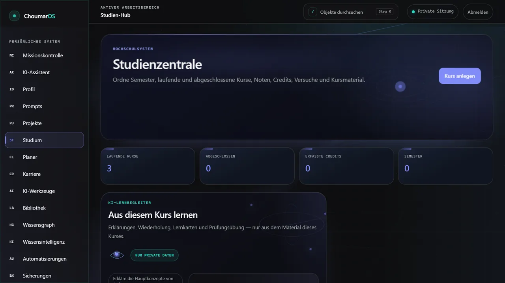
  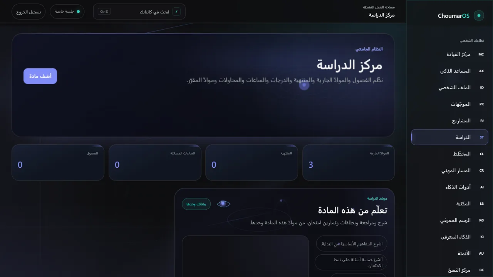

  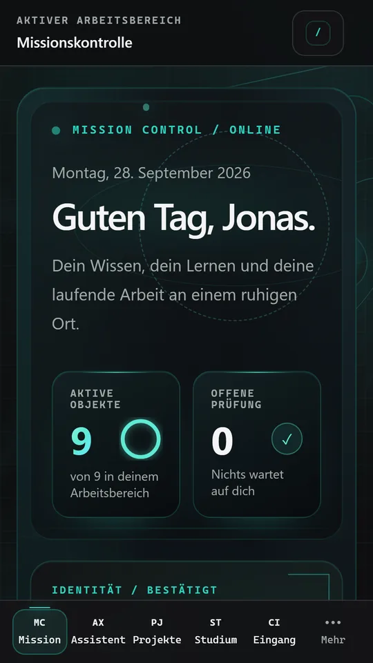
  &nbsp;
  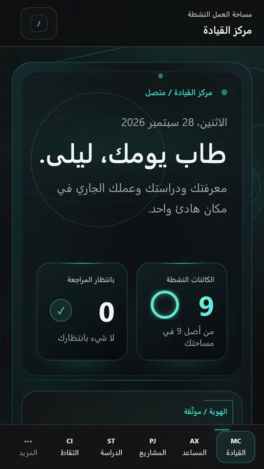
  &nbsp;
  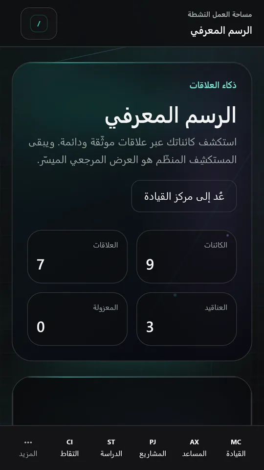

All screenshots, per language: [German](screenshots/de) · [Arabic](screenshots/ar).
They come from a test account with invented data — no real student appears anywhere.

## Launch visuals

  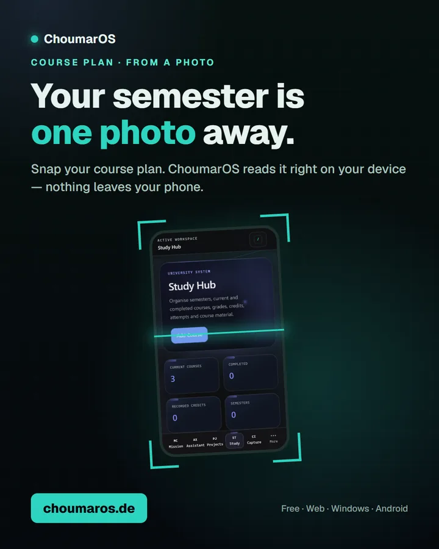
  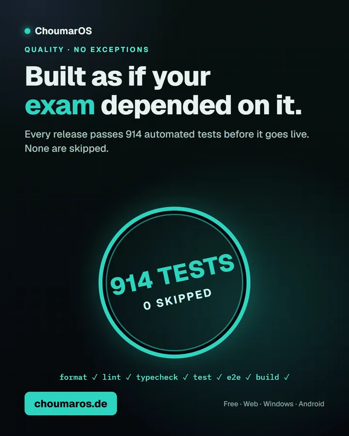
  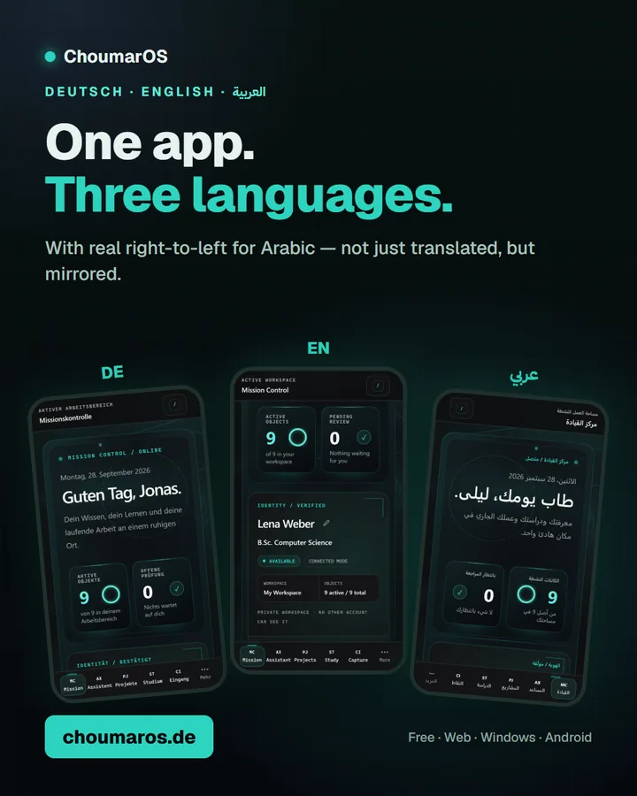
  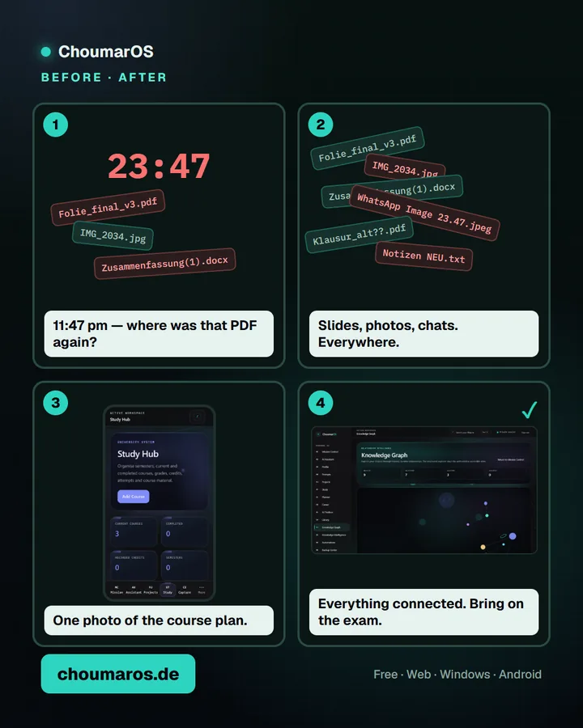

The same visuals in [German and Arabic](promo).

## Roadmap

Shipped in autumn 2026: spaced-repetition flashcards, an exam countdown, calendar export and
sharing a course with classmates.

Next:
- Public release on Google Play (October 2026)
- Reporting shared content, and a second free AI model so the assistant never stops

## Built with

Next.js · React · TypeScript · PostgreSQL (Supabase) · Drizzle ORM · Zod · Google Gemini ·
pgvector · Playwright · Vitest · axe-core · Vercel (Frankfurt) · PWA ·
Microsoft Store (MSIX) · Google Play (Trusted Web Activity)

## Contact

Questions and feedback: [choumaros.de/support](https://choumaros.de/support) ·
Portfolio: [choumar.is-a.dev](https://choumar.is-a.dev)

© 2026 Mohamad Ali Choumar. All rights reserved.
